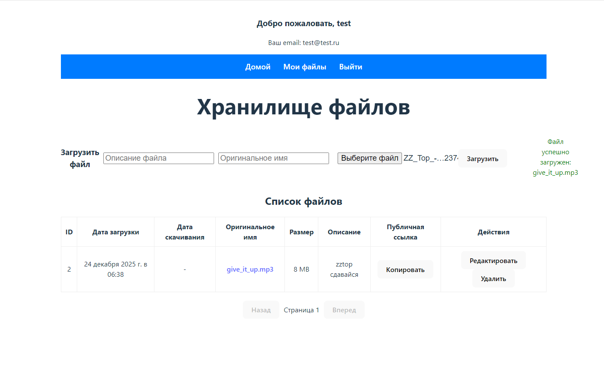

# Облачное хранилище файлов.
## Данное приложение позволяет сохранять файлы и обмениваться публичными ссылками на загруженные файлы.



## Общее описание возможностей.

* Регистрация пользователя.
* Аутентификация пользователя.
* Загрузка файлов
* Возможность установить описание на загруженный файл.
* Возможность установить оригинальное имя на загруженный файл.
* Скачивание файла по прямой ссылке с оригинальным именем.
* Формирование обезличенной публичной ссылки на загруженный файл.
* Возможность удаления файла.
* Возможность редактирования файла.
* Административная панель для управления пользователями и файлами.

## Используемый стек технологий.

При разработки использованы языки Python, Javascript. <br/>
В качестве Backend REST API использовался django rest_framework c авторизацией по сессиям.<br/>
Frontend часть разработана с использованием React с jsx технологиями React Router, Redux.  <br/>

## Развертывание системы на Linux Ubuntu.

1. **Клонируйте проект с использование git clone.**

2. **Создайте файл .env следующего содеражания, положите его в корень проекта (там где docker-compose.yml)**
```
#Django settings
SECRET_KEY=<some key here>
DEBUG=False

#Database credentials
DB_NAME=file_storage_db
DB_USERNAME=<some user>
DB_PASSWORD=<some user password>

VITE_APP_PERSIST_KEY=<some key here>
```

3. **Добавите Ваш внешиний IP в backend/storage_project/settings_sessions.py**
```
CORS_ALLOWED_ORIGINS = [
'http://ваш_ip',
]
CSRF_TRUSTED_ORIGINS = [
'http://ваш_ip',
]

```
4. **Добавьте Ваш внешний IP в docker-compose.yml**
```
    args:
        - VITE_APP_PERSIST_KEY=${VITE_APP_PERSIST_KEY}
        - VITE_API_URL=http://ВАШ_IP:8000
```

5. **Настройте Docker для работы с контейнерами.**

устанавливаем вспомогательные пакеты.
```
sudo apt-get update
sudo apt-get install ca-certificates curl gnupg
```
добавляем официальный GPG key 
```
sudo install -m 0755 -d /etc/apt/keyrings
curl -fsSL https://download.docker.com/linux/ubuntu/gpg | sudo gpg --dearmor -o /etc/apt/keyrings/docker.gpg
sudo chmod a+r /etc/apt/keyrings/docker.gpg
```
добавляем репозиторий докер в sourse.list
```
echo \
  "deb [arch=$(dpkg --print-architecture) signed-by=/etc/apt/keyrings/docker.gpg] https://download.docker.com/linux/ubuntu \
  $(. /etc/os-release && echo "$VERSION_CODENAME") stable" | \
  sudo tee /etc/apt/sources.list.d/docker.list > /dev/null
```
обновляем список пакетов.
```
sudo apt-get update
```
устанавливаем докер и плагин.
```
sudo apt-get install docker.io docker-compose docker-compose-plugin -y
```
устанавливаем современный сборщик.
```
sudo apt-get install docker-buildx-plugin
```
6. **Запускаем сборку проекта.**

собираем контейнеры backend и frontend.
```
sudo DOCKER_BUILDKIT=1 docker compose build --no-cache backend
```
запускаем.
```
sudo docker compose up -d
```
проверяем должны быть UP.
```
sudo docker compose ps
```
7. **Делаем необходимые миграции и настройки backend**

делаем миграции в базу postgresql
```
sudo docker compose exec backend python manage.py migrate
```
собираем статические файлы и копируем в staticfiles
```
sudo docker compose exec backend python manage.py collectstatic --no-input
```
создаем суперпользователя системы.
```
sudo docker compose exec backend python manage.py createsuperuser
```

8. **Подключение.**

`http://ваш_внешний_ip`
